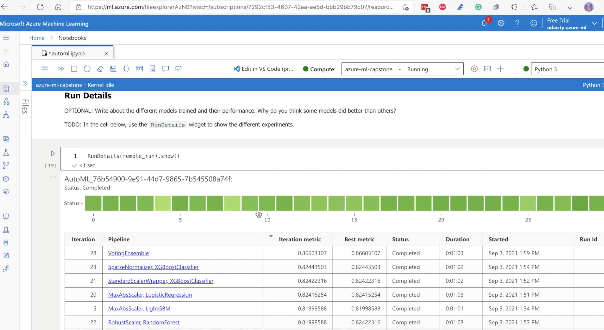
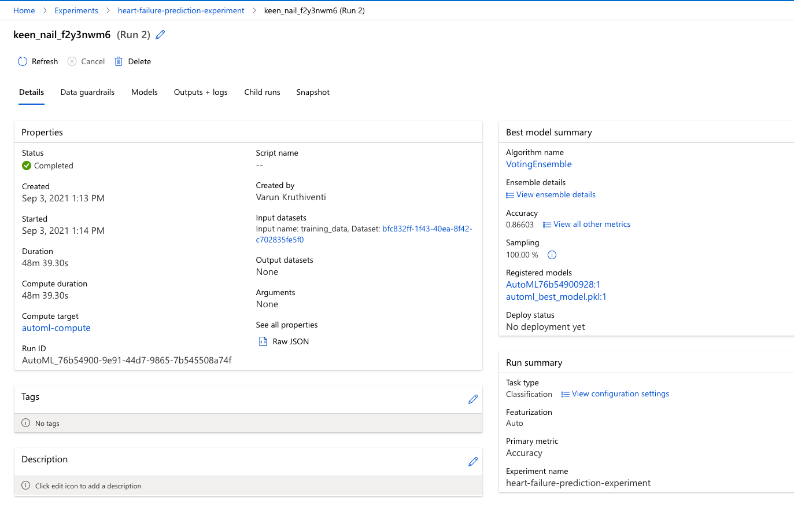
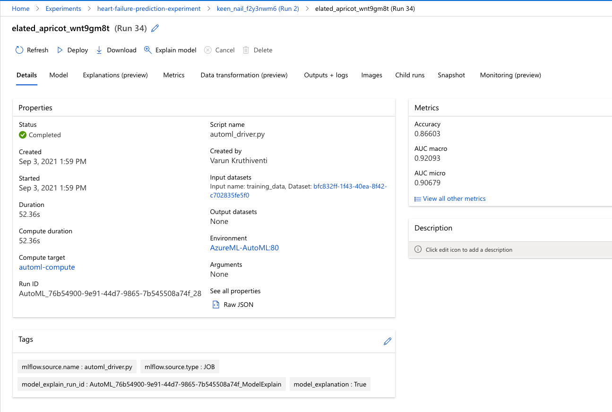
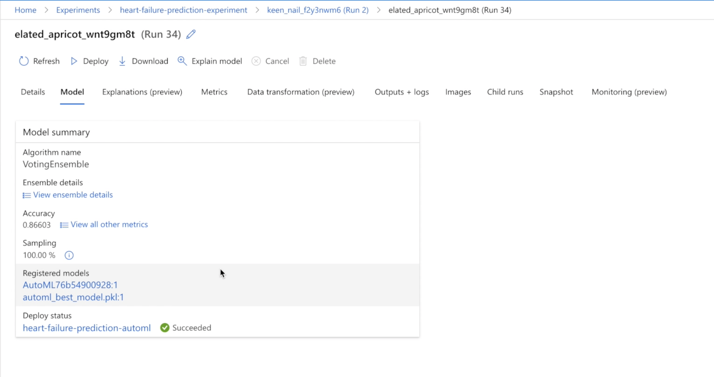
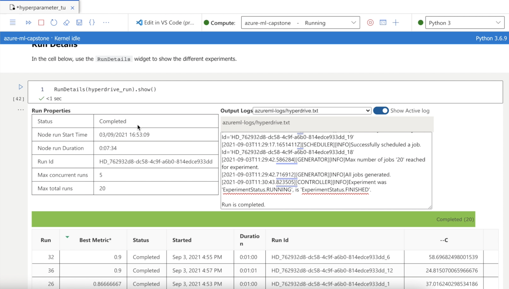
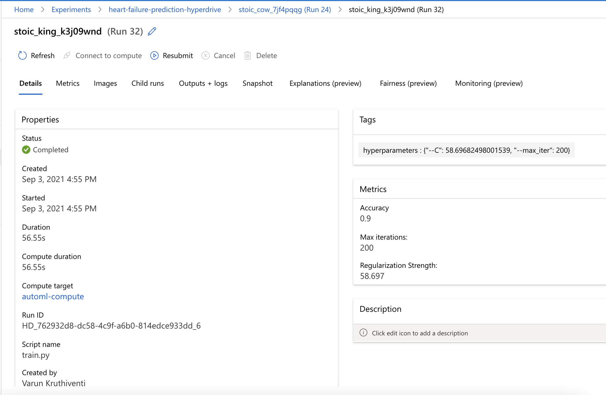
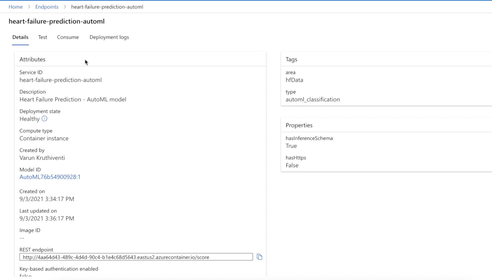
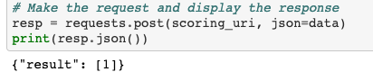

# Capstone Project - Machine Learning Engineer with Microsoft Azure

- This project has been submitted as part of the Machine Learning Engineer with Microsoft Azure Nanodegree.
- In this project, we have create two models: one using Automated ML (denoted as AutoML from now on) and one customized model whose hyperparameters are tuned using HyperDrive.
- We have used an external dataset instead of one's provided in Azure ML Studio.

## Dataset

### Overview

In this problem, we are using Heart Failure Prediction dataset. from Kaggle. The dataset has the below set of 12 features and a target variable :

| column        | Description  |
| :----- | :---------------|
|age | Age of the patient|
|amaemia| Decrease of red blood cells or hemoglobin|
|creatinine_phosphokinase| Level of the CPK enzyme in the blood (mcg/L)|
|diabetes| If the patient has diabetes|
|ejection_fraction| Percentage of blood leaving the heart at each contraction|
high_blood_pressure| If the patient has hypertension|
|platelets| Platelets in the blood (kiloplatelets/mL)|
|serum_creatinine| Level of serum creatinine in the blood (mg/dL)|
|serum_sodium| Level of serum sodium in the blood (mEq/L)|
|sex| Woman or man|
|smoking| If the patient smokes or not|
|time| Follow-up period (days)|
|DEATH_EVENT (target)| If the patient deceased during the follow-up period (boolean)|

### Task

In this project, we will be using the 12 features to predict DEATH_EVENT outcome, which is If the patient deceased during the follow-up period (boolean).

This is a binary classification problem.

### Access

The dataset has been downloaded from Kaggle and uploaded to this GitHub repository. The dataset is then accessed as a TabularDataset using the URL of the raw .csv file.

```bash
https://raw.githubusercontent.com/saivarunk/udacity-ml-azure-capstone-project/master/dataset/heart_failure_clinical_records_dataset.csv
```

## Automated ML

The AutomatedML Run was created using an instance of AutoMLConfig. The AutoML Config Class is a way of leveraging the AutoML SDK to automate machine learning. 

The following parameters have been used for the Auto ML Run.

```bash
# AutoML settings
automl_settings = {
    "task": "classification",
    "debug_log": 'automl_errors.log',
    "training_data": train_data,
    "label_column_name": 'DEATH_EVENT',
    "compute_target": compute_cluster,
    "enable_early_stopping" : True,
    "experiment_timeout_minutes": 30,
    "n_cross_validations": 4,
    "featurization": 'auto',
    "primary_metric": 'accuracy',
    "verbosity": logging.INFO
}

# AutoML config initialization
automl_config = AutoMLConfig(**automl_settings)
```


| Parameter        | Value          | Description  |
| :----- |:-----:| :---------------|
| task     | 'classification' | Classification is selected since we are performing binary classification |
| label_column_name | 'DEATH_EVENT' | DEATH_EVENT is the target column, hence we are passing it |
| experiment_timeout_minutes | 30  | We can select an optimum time period to complete the automl experiment |
| primary_metric | 'accuracy'    | This metric will be used by AutoML to optimize for model_selection |
| enable_early_stopping | True | Early Stopping is enabled to terminate a run in case the score is not improving in short term. This allows AutoML to train more better models in shorter timeframe |
| featurization | 'auto'   | Featurization is set to auto so that the featurization step is done automatically |
| n_cross_validations | 4  | No. of cross validation splits to be done during the experiment |


### Results

- The model trained using AutoML searched for various algorithms to find which would perform better for this dataset.
- Several algorithms including XGBoostClassifier, LogisticRegression, LightGBM, RandomForest, are trained
- Of all, the VotingEnsemble stood at the top with an accuracy of **0.8660**.
- AutoML automatically selected the best hyperparameters for the model training. AutoML automatically selects the algorithm and associated hyperparameters.
  


**The details of the AutoML run using the RunDetails Widget:**




**Once the run was finished the summary of the run can be seen below:**



**The VotingEnsemble model details are shown below:**







## Hyperparameter Tuning
- The model used for hyperparameter tuning with HyperDrive is a Sklearn based Logistic Regression Model, which is trained using a custom script- train.py.
- The dataset is fetched from a url as a TabularDataset. The hyperparameters chosen for the Scikit-learn model are regularization strength (C) and max iterations (max_iter).
- We have choosen RandomParameterSampling as an sampling method. It randomly selects the best hyperparameters for the model, that way the entire search space does not need to be searched.
- The early stopping policy used in this project is Bandit Policy which is based on a slack factor of 0.1and an evaluation interval 1.

```bash
param_sampling = RandomParameterSampling(
    {
        "--C": uniform(0.001, 100),
        "--max_iter": choice(50, 75, 100, 125, 150, 175, 200)
    }
)
```

### Results

The best HyperDrive run achieved an accuracy of **90%**. The hyperparameters selected for the best HyperDrive run are listed below- 

| Parameter        | Value          | 
| :----- |:-----:| 
| Regularization Strength (C) | 58.697 |
| Max iterations (max_iter) | 200 |


**The details of the HyperDrive run are monitored using the Run Details widget.**




The best model obtained from the HyperDrive Experiment achieved an accuracy of **90%** The values of the hyperparameters selected for this model are shown below:



## Model Deployment

In this project, I have deployed the VotingEnsemble model generated by AutoML experiment run.

### Steps for Model Deployment

#### Register the Model

```bash
model_name = best_run.properties['model_name']
model = remote_run.register_model(model_name=model_name)
```

#### Define an Entry Script

- The entry script receives data passed to the deployed endpoint and passes it to the model. 
- It then takes the response returned by the model and returns that to the client.
- For an AutoML model this script can be downloaded from files generated by the AutoML run. The following code snippet shows that.

```
script_file_name = 'inference/score.py'
best_run.download_file('outputs/scoring_file_v_1_0_0.py', 'inference/score.py')
```

#### Define an Inference Configuration

An inference configuration describes how to set up the web-service containing your model. It's used later, when you deploy the model.

```
inference_config = InferenceConfig(entry_script=script_file_name)
```

#### Define a Deployment Configuration

```
aciconfig = AciWebservice.deploy_configuration(cpu_cores = 1, memory_gb = 1, 
                                               tags = {'area': "hfData", 'type': "automl_classification"}, 
                                               description = 'Heart Failure Prediction - AutoML model')
```

#### Deploy the Model

```
aci_service = Model.deploy(ws, aci_service_name, [model], inference_config, aciconfig)
```


Once the model is deployed the model endpoint can be accessed from the Endpoints section




The following piece of code can be used to interact with the deployed model by sending it data points :

```bash
import requests
import json

# URL for the web service, should be similar to:
# 'http://<endpoint_id>.eastus.azurecontainer.io/score'

scoring_uri = aci_service.scoring_uri # Set the scoring_uri directly from aci_service object

# Two sets of data to score, so we get two results back
data = {"data":
        [
          {
            "age": 55.0,
            "anaemia": 0,
            "creatinine_phosphokinase": 4010,
            "diabetes": 0,
            "ejection_fraction": 32,
            "high_blood_pressure": 1,
            "platelets": 234558.23,
            "serum_creatinine": 1.4,
            "serum_sodium": 125,
            "sex": 1,
            "smoking": 0,
            "time": 12
          },
      ]
    }

# Make the request and display the response
resp = requests.post(scoring_uri, json=data)
print(resp.json())
```

**The result obtained from the deployed service**




## Screen Recording

[https://www.youtube.com/watch?v=xhgn7Pc3Ehc](https://www.youtube.com/watch?v=xhgn7Pc3Ehc)
